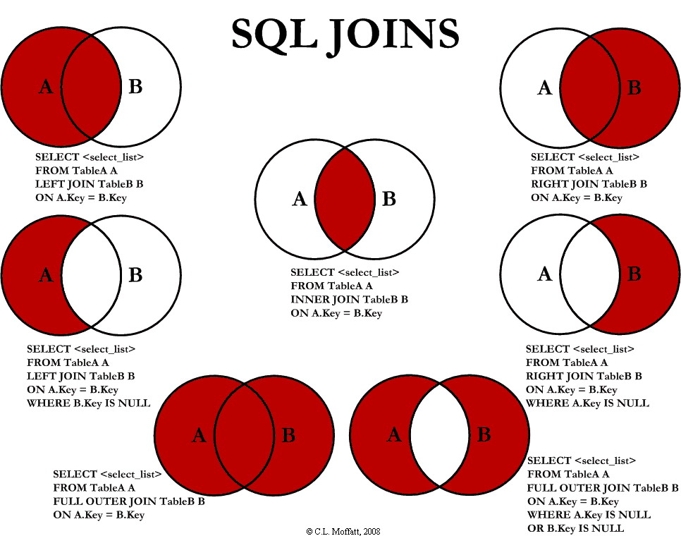

# Keys, JOIN, and UNION

## Overview of session

In this lecture, you'll introduce queries that combine data from multiple tables in a relational database.


## Session objectives

* Keys (Primary, Natural, Surrogate, Foreign)
* Cardinality (1-1, 1-N, N-M)
* SQL Joins (INNER AND LEFT JOIN)
* Unions
* Introduce a new database (MovieDB)

## Instructor notes

1. **Problem statement**

	Using `ORDER BY` and `GROUP BY`, we can sort and aggregate our data. However our data has so far been limited to coming from a single table. Only by JOINING our data using keys can we get the total picture.

2. **EXAMPLE - Amazon Scenario**

	> Imagine a USERS table containing records for each user.
	>
	> Imagine a SHIPPING_ADDRESSES table containing all shipping addresses for a user.
	>
	> Imagine a PRODUCTS table containing all product data.
	>
	> Imagine a PURCHASES table containing all products a user purchases.

	- What users have shipping addresses in OHIO?
	- Which users have brought product X?
	- What's the top product sent to INDIANA?

3. **Keys**
	- Keys create relationships between two tables.
	- Multiple Key Types
		1. **Natural Keys** are formed from values in the real world, like SSN, ISBN, Tax Id, and Email.
		2. **Surrogate Keys** are artificially created by the application and identify a unique record.
		3. **Primary Keys** uniquely identify each row within a table. They can't be duplicated within that table and can't be null. It's typically a single column, but it can also be comprised of multiple columns.
		4. **Foreign Keys** exist in other tables and are used to reference a primary key in the source table.

4. **Cardinality**

	- A **relationship** in a relational database is an association between two tables.

	- **Cardinality** refers to the maximum number of times that an instance in one entity can be associated with instances in a related entity, along with the minimum number of times it must be associated.

	- A **foreign key** is used to reference records in another table where the primary key is held.

	- **Crow's foot notation** is a way to indicate cardinality in an Entity Relationship Diagram (ERD).

		


5. **SQL Joins**

	

	- SQL JOINs allow us to create queries that retrieve data from one or more tables.

	- Related records are "joined" into a single result.

	- Joins are referred to as **INNER** and **OUTER**. The tables involved in a JOIN are referred to as **LEFT** and **RIGHT**.

	- The default JOIN is an INNER JOIN.

	- In an INNER join of table A and B, the result consists of the intersection of A and B. The inner part of a Venn diagram.

	- You can use INNER JOINs to select rows from both tables as long as there is a match between columns in both tables.

	- *Go through the examples in the `lecture.sql` file for INNER JOIN.*

	- LEFT OUTER JOIN can be shortened to LEFT JOIN when writing queries.

	- In an OUTER join of table A and B, the result consists of all records from the LEFT side and any common matches on the RIGHT side.

	- OUTER JOINs return NULL where rows aren't matched.

	- *Go through the examples in the `lecture.sql` file for LEFT JOIN.*

	- When writing queries with joins, you can use aliases for the table names to avoid having to write out the full names of the tables. Return to some of the queries you've already written and demonstrate this.

	- Aliases are also useful for joining a table to itself. If there's time, you can demonstrate this by writing a query to find the 2 cities in the `UnitedStates` database with the same population, like this:
	```
	SELECT c1.city_name, c2.city_name
	FROM city AS c1
	JOIN city AS c2 ON c1.population = c2.population AND c1.city_id < c2.city_id;
	```

6. **Unions**

	- A SQL UNION combines the results of two or more queries into a single result set.

	- The number of columns involved must match exactly and data types must be identical.

	- Duplicate rows are removed.

	- A good example for this is a database that might have faculty and students separated in different tables, but we want to return all people who attend or work at a school.

	- *Go through the examples in the `lecture.sql` file for UNION.*

7. **MovieDB**

	- The students have a new database to use for today's exercises called `MovieDB`. Walk them through setting up this database like they did previously for the `UnitedStates` database, using the provided SQL file.

	- Be sure to name the database `MovieDB`.

	- Be aware that the `MovieDB` database isn't comprehensive. It contains a random sample of movies and actors from a public API.

	- An ERD is included in the `lecture-student` folder. Look at it with the students to make sure they're familiar with the schema before starting their exercises.

	- *Go through the examples in the `lecture.sql` file for `MovieDB`.*